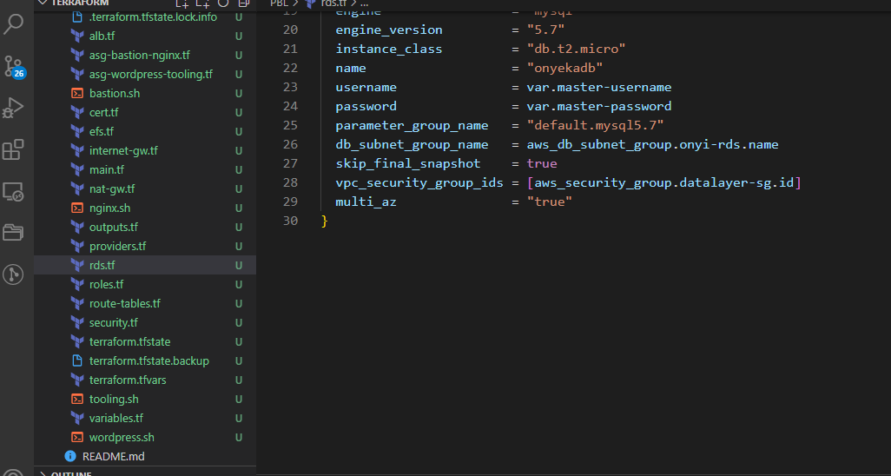

# PROJECT 17

## Continue Infrastructure Automation with Terraform

Let us continue from where we have stopped in Project 16.

Based on the knowledge from the previous project lets keep on creating AWS resources!

## Networking

### Private subnets & best practices

Create 4 private subnets keeping in mind following principles:

- Make sure you use variables or length() function to determine the number of AZs
- Use variables and cidrsubnet() function to allocate vpc_cidr for subnets
- Keep variables and resources in separate files for better code structure and readability
- Tags all the resources you have created so far. Explore how to use format() and count functions to automatically tag subnets with its respective number.

### A little bit more about Tagging

Tagging is a straightforward, but a very powerful concept that helps you manage your resources much more efficiently:

- Resources are much better organized in ‘virtual’ groups
- They can be easily filtered and searched from console or programmatically
- Billing team can easily generate reports and determine how much each part of infrastructure costs how much (by department, by type, by environment, etc.)
- You can easily determine resources that are not being used and take actions accordingly
- If there are different teams in the organisation using the same account, tagging can help differentiate who owns which resources.

**Note**: You can add multiple tags as a default set. for example, in out terraform.tfvars file we can have default tags defined.

```
tags = {
  Enviroment      = "production" 
  Owner-Email     = "dare@darey.io"
  Managed-By      = "Terraform"
  Billing-Account = "1234567890"
}
```

Now you can tag all your resources using the format below

```
tags = merge(
    var.tags,
    {
      Name = "Name of the resource"
    },
  )
```

**NOTE**: Update the variables.tf to declare the variable tags used in the format above;

```
variable "tags" {
  description = "A mapping of tags to assign to all resources."
  type        = map(string)
  default     = {}
}
```

The nice thing about this is – anytime we need to make a change to the tags, we simply do that in one single place (terraform.tfvars).

But, our key-value pairs are hard coded. So, go ahead and work out a fix for that. Simply create variables for each value and use var.variable_name as the value to each of the keys.
Apply the same best practices for all other resources you will create further.

## Internet Gateways & format() function

Create an Internet Gateway in a separate Terraform file internet_gateway.tf

```
resource "aws_internet_gateway" "ig" {
  vpc_id = aws_vpc.main.id

  tags = merge(
    var.tags,
    {
      Name = format("%s-%s!", aws_vpc.main.id,"IG")
    } 
  )
}
```

Did you notice how we have used format() function to dynamically generate a unique name for this resource? The first part of the %s takes the interpolated value of aws_vpc.main.id while the second %s appends a literal string IG and finally an exclamation mark is added in the end.

If any of the resources being created is either using the count function, or creating multiple resources using a loop, then a key-value pair that needs to be unique must be handled differently.

For example, each of our subnets should have a unique name in the tag section. Without the format() function, we would not be able to see uniqueness. With the format function, each private subnet’s tag will look like this.

Name = onyi-prvate-1
Name = onyi-prvate-2
Name = onyi-prvate-3
Lets try and see that in action.
```
  tags = merge(
    var.tags,
    {
      Name = format("%s-private-%s", var.name, count.index + 1)
    },
  )
```

### NAT Gateways

Create 1 NAT Gateway and 1 Elastic IP (EIP) address

Now use similar approach to create the NAT Gateways in a new file called natgateway.tf.

**Note**: We need to create an Elastic IP for the NAT Gateway, and you can see the use of depends_on to indicate that the Internet Gateway resource must be available before this should be created. Although Terraform does a good job to manage dependencies, but in some cases, it is good to be explicit.

You can read more on dependencies here - https://www.terraform.io/docs/language/meta-arguments/depends_on.html

```
resource "aws_eip" "nat_eip" {
  vpc        = true
  depends_on = [aws_internet_gateway.ig]

  tags = merge(
    var.tags,
    {
      Name = format("%s-EIP", var.name)
    },
  )
}

resource "aws_nat_gateway" "nat" {
  allocation_id = aws_eip.nat_eip.id
  subnet_id     = element(aws_subnet.public.*.id, 0)
  depends_on    = [aws_internet_gateway.ig]

  tags = merge(
    var.tags,
    {
      Name = format("%s-Nat", var.name)
    },
  )
}
```

## AWS ROUTES

Create a file called **route_tables.tf** and use it to create routes for both public and private subnets, create the below resources. Ensure they are properly tagged.

- aws_route_table
- aws_route
- aws_route_table_association

```
# create private route table
resource "aws_route_table" "private-rtb" {
  vpc_id = aws_vpc.main.id

  tags = merge(
    var.tags,
    {
      Name = format("%s-Private-Route-Table", var.name)
    },
  )
}

# associate all private subnets to the private route table
resource "aws_route_table_association" "private-subnets-assoc" {
  count          = length(aws_subnet.private[*].id)
  subnet_id      = element(aws_subnet.private[*].id, count.index)
  route_table_id = aws_route_table.private-rtb.id
}

# create route table for the public subnets
resource "aws_route_table" "public-rtb" {
  vpc_id = aws_vpc.main.id

  tags = merge(
    var.tags,
    {
      Name = format("%s-Public-Route-Table", var.name)
    },
  )
}

# create route for the public route table and attach the internet gateway
resource "aws_route" "public-rtb-route" {
  route_table_id         = aws_route_table.public-rtb.id
  destination_cidr_block = "0.0.0.0/0"
  gateway_id             = aws_internet_gateway.ig.id
}

# associate all public subnets to the public route table
resource "aws_route_table_association" "public-subnets-assoc" {
  count          = length(aws_subnet.public[*].id)
  subnet_id      = element(aws_subnet.public[*].id, count.index)
  route_table_id = aws_route_table.public-rtb.id
}
```

Now if you run terraform plan and terraform apply it will add the following resources to AWS in multi-az set up:

– Our main vpc
– 2 Public subnets
– 4 Private subnets
– 1 Internet Gateway
– 1 NAT Gateway
– 1 EIP
– 2 Route tables

Now, we are done with Networking part of AWS set up, let us move on to Compute and Access Control configuration automation using Terraform!

## AWS Identity and Access Management

### IaM and Roles

We want to pass an IAM role to our EC2 instances to give them access to some specific resources, so we need to do the following:

1. Create **AssumeRole**

Assume Role uses Security Token Service (STS) API that returns a set of temporary security credentials that you can use to access AWS resources that you might not normally have access to. These temporary credentials consist of an access key ID, a secret access key, and a security token. Typically, you use **AssumeRole** within your account or for cross-account access.

Add the following code to a new file named roles.tf

```
resource "aws_iam_role" "ec2_instance_role" {
name = "ec2_instance_role"
  assume_role_policy = jsonencode({
    Version = "2012-10-17"
    Statement = [
      {
        Action = "sts:AssumeRole"
        Effect = "Allow"
        Sid    = ""
        Principal = {
          Service = "ec2.amazonaws.com"
        }
      },
    ]
  })

  tags = merge(
    var.tags,
    {
      Name = "aws assume role"
    },
  )
}
```

In this code we are creating AssumeRole with AssumeRole policy. It grants to an entity, in our case it is an EC2, permissions to assume the role.

2. Create IAM policy for this role

This is where we need to define a required policy (i.e., permissions) according to our requirements. For example, allowing an IAM role to perform action describe applied to EC2 instances:

resource "aws_iam_policy" "policy" {
  name        = "ec2_instance_policy"
  description = "A test policy"
  policy = jsonencode({
    Version = "2012-10-17"
    Statement = [
      {
        Action = [
          "ec2:Describe*",
        ]
        Effect   = "Allow"
        Resource = "*"
      },
    ]

  })

  tags = merge(
    var.tags,
    {
      Name =  "aws assume policy"
    },
  )

}

3. Attach the Policy to the IAM Role
This is where, we will be attaching the policy which we created above, to the role we created in the first step.

```
    resource "aws_iam_role_policy_attachment" "test-attach" {
        role       = aws_iam_role.ec2_instance_role.name
        policy_arn = aws_iam_policy.policy.arn
    }
```

4. Create an Instance Profile and interpolate the IAM Role

```
    resource "aws_iam_instance_profile" "ip" {
        name = "aws_instance_profile_test"
        role =  aws_iam_role.ec2_instance_role.name
    }
```

We are pretty much done with Identity and Management part for now, let us move on and create other resources required.

### Resources to be created

As per our architecture we need to do the following:

1. Create Security Groups
2. Create Target Group for Nginx, WordPress and Tooling
3. Create certificate from AWS certificate manager
4. Create an External Application Load Balancer and Internal  Application Load Balancer.
5. create launch template for Bastion, Tooling, Nginx and WordPress
6. Create an Auto Scaling Group (ASG) for Bastion, Tooling, Nginx and WordPress
7. Create Elastic Filesystem
8. Create Relational Database (RDS)

Let us create some Terraform configuration code to accomplish these tasks.

## CREATE SECURITY GROUPS

We are going to create all the security groups in a single file, then we are going to refrence this security group within each resources that needs it.

IMPORTANT:

Check out the terraform documentation for security group - https://registry.terraform.io/providers/hashicorp/aws/latest/docs/resources/security_group

Check out the terraform documentation for security group rule - https://registry.terraform.io/providers/hashicorp/aws/latest/docs/resources/security_group_rule

Create a file and name it **security.tf**, copy and paste the code below

```
# security group for alb, to allow acess from any where for HTTP and HTTPS traffic
resource "aws_security_group" "ext-alb-sg" {
  name        = "ext-alb-sg"
  vpc_id      = aws_vpc.main.id
  description = "Allow TLS inbound traffic"

  ingress {
    description = "HTTP"
    from_port   = 80
    to_port     = 80
    protocol    = "tcp"
    cidr_blocks = ["0.0.0.0/0"]
  }

  ingress {
    description = "HTTPS"
    from_port   = 443
    to_port     = 443
    protocol    = "tcp"
    cidr_blocks = ["0.0.0.0/0"]
  }

  egress {
    from_port   = 0
    to_port     = 0
    protocol    = "-1"
    cidr_blocks = ["0.0.0.0/0"]
  }

 tags = merge(
    var.tags,
    {
      Name = "ext-alb-sg"
    },
  )

}

# security group for bastion, to allow access into the bastion host from you IP
resource "aws_security_group" "bastion_sg" {
  name        = "bastion_sg"
  vpc_id = aws_vpc.main.id
  description = "Allow incoming HTTP connections."

  ingress {
    description = "SSH"
    from_port   = 22
    to_port     = 22
    protocol    = "tcp"
    cidr_blocks = ["0.0.0.0/0"]
  }

  egress {
    from_port   = 0
    to_port     = 0
    protocol    = "-1"
    cidr_blocks = ["0.0.0.0/0"]
  }

   tags = merge(
    var.tags,
    {
      Name = "Bastion-SG"
    },
  )
}

#security group for nginx reverse proxy, to allow access only from the external load balancer and bastion instance
resource "aws_security_group" "nginx-sg" {
  name   = "nginx-sg"
  vpc_id = aws_vpc.main.id

  egress {
    from_port   = 0
    to_port     = 0
    protocol    = "-1"
    cidr_blocks = ["0.0.0.0/0"]
  }

   tags = merge(
    var.tags,
    {
      Name = "nginx-SG"
    },
  )
}

resource "aws_security_group_rule" "inbound-nginx-http" {
  type                     = "ingress"
  from_port                = 443
  to_port                  = 443
  protocol                 = "tcp"
  source_security_group_id = aws_security_group.ext-alb-sg.id
  security_group_id        = aws_security_group.nginx-sg.id
}

resource "aws_security_group_rule" "inbound-bastion-ssh" {
  type                     = "ingress"
  from_port                = 22
  to_port                  = 22
  protocol                 = "tcp"
  source_security_group_id = aws_security_group.bastion_sg.id
  security_group_id        = aws_security_group.nginx-sg.id
}

# security group for ialb, to have acces only from nginx reverser proxy server
resource "aws_security_group" "int-alb-sg" {
  name   = "int-alb-sg"
  vpc_id = aws_vpc.main.id

  egress {
    from_port   = 0
    to_port     = 0
    protocol    = "-1"
    cidr_blocks = ["0.0.0.0/0"]
  }

  tags = merge(
    var.tags,
    {
      Name = "int-alb-sg"
    },
  )

}

resource "aws_security_group_rule" "inbound-ialb-https" {
  type                     = "ingress"
  from_port                = 443
  to_port                  = 443
  protocol                 = "tcp"
  source_security_group_id = aws_security_group.nginx-sg.id
  security_group_id        = aws_security_group.int-alb-sg.id
}

# security group for webservers, to have access only from the internal load balancer and bastion instance
resource "aws_security_group" "webserver-sg" {
  name   = "webserver-sg"
  vpc_id = aws_vpc.main.id

  egress {
    from_port   = 0
    to_port     = 0
    protocol    = "-1"
    cidr_blocks = ["0.0.0.0/0"]
  }

  tags = merge(
    var.tags,
    {
      Name = "webserver-sg"
    },
  )

}

resource "aws_security_group_rule" "inbound-web-https" {
  type                     = "ingress"
  from_port                = 443
  to_port                  = 443
  protocol                 = "tcp"
  source_security_group_id = aws_security_group.int-alb-sg.id
  security_group_id        = aws_security_group.webserver-sg.id
}

resource "aws_security_group_rule" "inbound-web-ssh" {
  type                     = "ingress"
  from_port                = 22
  to_port                  = 22
  protocol                 = "tcp"
  source_security_group_id = aws_security_group.bastion_sg.id
  security_group_id        = aws_security_group.webserver-sg.id
}

# security group for datalayer to alow traffic from websever on nfs and mysql port and bastiopn host on mysql port
resource "aws_security_group" "datalayer-sg" {
  name   = "datalayer-sg"
  vpc_id = aws_vpc.main.id

  egress {
    from_port   = 0
    to_port     = 0
    protocol    = "-1"
    cidr_blocks = ["0.0.0.0/0"]
  }

 tags = merge(
    var.tags,
    {
      Name = "datalayer-sg"
    },
  )
}

resource "aws_security_group_rule" "inbound-nfs-port" {
  type                     = "ingress"
  from_port                = 2049
  to_port                  = 2049
  protocol                 = "tcp"
  source_security_group_id = aws_security_group.webserver-sg.id
  security_group_id        = aws_security_group.datalayer-sg.id
}

resource "aws_security_group_rule" "inbound-mysql-bastion" {
  type                     = "ingress"
  from_port                = 3306
  to_port                  = 3306
  protocol                 = "tcp"
  source_security_group_id = aws_security_group.bastion_sg.id
  security_group_id        = aws_security_group.datalayer-sg.id
}

resource "aws_security_group_rule" "inbound-mysql-webserver" {
  type                     = "ingress"
  from_port                = 3306
  to_port                  = 3306
  protocol                 = "tcp"
  source_security_group_id = aws_security_group.webserver-sg.id
  security_group_id        = aws_security_group.datalayer-sg.id
}
```

**IMPORTANT NOTE**: We used the **aws_security_group_rule** to refrence another security group in a security group.


## CREATE CERTIFICATE FROM AMAZON CERIFICATE MANAGER

Create **cert.tf** file and add the following code snippets to it.

**NOTE**: Read Through to change the domain name to your own domain name and every other name that needs to be changed.

Check out the terraform documentation for AWS Certifivate mangarer

```
# The entire section create a certiface, public zone, and validate the certificate using DNS method

# Create the certificate using a wildcard for all the domains created in onyeka.ga
resource "aws_acm_certificate" "onyeka" {
  domain_name       = "*.onyeka.ga"
  validation_method = "DNS"
}

# calling the hosted zone
data "aws_route53_zone" "onyeka" {
  name         = "onyeka.ga"
  private_zone = false
}

# selecting validation method
resource "aws_route53_record" "onyeka" {
  for_each = {
    for dvo in aws_acm_certificate.onyeka.domain_validation_options : dvo.domain_name => {
      name   = dvo.resource_record_name
      record = dvo.resource_record_value
      type   = dvo.resource_record_type
    }
  }

  allow_overwrite = true
  name            = each.value.name
  records         = [each.value.record]
  ttl             = 60
  type            = each.value.type
  zone_id         = data.aws_route53_zone.onyeka.zone_id
}

# validate the certificate through DNS method
resource "aws_acm_certificate_validation" "onyeka" {
  certificate_arn         = aws_acm_certificate.onyeka.arn
  validation_record_fqdns = [for record in aws_route53_record.onyeka : record.fqdn]
}

# create records for tooling
resource "aws_route53_record" "tooling" {
  zone_id = data.aws_route53_zone.onyeka.zone_id
  name    = "tooling.onyeka.ga"
  type    = "A"

  alias {
    name                   = aws_lb.ext-alb.dns_name
    zone_id                = aws_lb.ext-alb.zone_id
    evaluate_target_health = true
  }
}

# create records for wordpress
resource "aws_route53_record" "wordpress" {
  zone_id = data.aws_route53_zone.onyeka.zone_id
  name    = "wordpress.onyeka.ga"
  type    = "A"

  alias {
    name                   = aws_lb.ext-alb.dns_name
    zone_id                = aws_lb.ext-alb.zone_id
    evaluate_target_health = true
  }
}
```

3. **Create an external (Internet facing) Application Load Balancer (ALB)**

Create a file called **alb.tf**

First of all we will create the ALB, then we create the target group and lastly we will create the lsitener rule.

Useful Terraform Documentation, go through this documentation and understand the arguement needed for each resources:

- ALB : https://registry.terraform.io/providers/hashicorp/aws/latest/docs/resources/lb
- ALB-target : https://registry.terraform.io/providers/hashicorp/aws/latest/docs/resources/lb_target_group
- ALB-listener : https://registry.terraform.io/providers/hashicorp/aws/latest/docs/resources/lb_listener

We need to create an ALB to balance the traffic between the Instances:

```
resource "aws_lb" "ext-alb" {
  name     = "ext-alb"
  internal = false
  security_groups = [
    aws_security_group.ext-alb-sg.id,
  ]

  subnets = [
    aws_subnet.public[0].id,
    aws_subnet.public[1].id
  ]

   tags = merge(
    var.tags,
    {
      Name = "ACS-ext-alb"
    },
  )

  ip_address_type    = "ipv4"
  load_balancer_type = "application"
}
```

To inform our ALB to where route the traffic we need to create a Target Group to point to its targets:

```
resource "aws_lb_target_group" "nginx-tgt" {
  health_check {
    interval            = 10
    path                = "/healthstatus"
    protocol            = "HTTPS"
    timeout             = 5
    healthy_threshold   = 5
    unhealthy_threshold = 2
  }
  name        = "nginx-tgt"
  port        = 443
  protocol    = "HTTPS"
  target_type = "instance"
  vpc_id      = aws_vpc.main.id
}
```

Then we will need to create a Listner for this target Group

```
resource "aws_lb_listener" "nginx-listner" {
  load_balancer_arn = aws_lb.ext-alb.arn
  port              = 443
  protocol          = "HTTPS"
  certificate_arn   = aws_acm_certificate_validation.oyindamola.certificate_arn

  default_action {
    type             = "forward"
    target_group_arn = aws_lb_target_group.nginx-tgt.arn
  }
}
```

Add the following outputs to output.tf to print them on screen

```
output "alb_dns_name" {
  value = aws_lb.ext-alb.dns_name
}

output "alb_target_group_arn" {
  value = aws_lb_target_group.nginx-tgt.arn
}
```

Create an Internal (Internal) Application Load Balancer (ALB)
For the Internal Load balancer we will fillow thje same concepts with the external load balancer.

Add the code snippets inside the alb.tf file

```
# ----------------------------
#Internal Load Balancers for webservers
#---------------------------------

resource "aws_lb" "ialb" {
  name     = "ialb"
  internal = true
  security_groups = [
    aws_security_group.int-alb-sg.id,
  ]

  subnets = [
    aws_subnet.private[0].id,
    aws_subnet.private[1].id
  ]

  tags = merge(
    var.tags,
    {
      Name = "ACS-int-alb"
    },
  )

  ip_address_type    = "ipv4"
  load_balancer_type = "application"
}
```

To inform our ALB to where route the traffic we need to create a Target Group to point to its targets:

```
# --- target group  for wordpress -------

resource "aws_lb_target_group" "wordpress-tgt" {
  health_check {
    interval            = 10
    path                = "/healthstatus"
    protocol            = "HTTPS"
    timeout             = 5
    healthy_threshold   = 5
    unhealthy_threshold = 2
  }

  name        = "wordpress-tgt"
  port        = 443
  protocol    = "HTTPS"
  target_type = "instance"
  vpc_id      = aws_vpc.main.id
}

# --- target group for tooling -------

resource "aws_lb_target_group" "tooling-tgt" {
  health_check {
    interval            = 10
    path                = "/healthstatus"
    protocol            = "HTTPS"
    timeout             = 5
    healthy_threshold   = 5
    unhealthy_threshold = 2
  }

  name        = "tooling-tgt"
  port        = 443
  protocol    = "HTTPS"
  target_type = "instance"
  vpc_id      = aws_vpc.main.id
}
```

Then we will need to create a Listner for this target Group

# For this aspect a single listener was created for the wordpress which is default,
# A rule was created to route traffic to tooling when the host header changes

```
resource "aws_lb_listener" "web-listener" {
  load_balancer_arn = aws_lb.ialb.arn
  port              = 443
  protocol          = "HTTPS"
  certificate_arn   = aws_acm_certificate_validation.oyindamola.certificate_arn

  default_action {
    type             = "forward"
    target_group_arn = aws_lb_target_group.wordpress-tgt.arn
  }
}

# listener rule for tooling target

resource "aws_lb_listener_rule" "tooling-listener" {
  listener_arn = aws_lb_listener.web-listener.arn
  priority     = 99

  action {
    type             = "forward"
    target_group_arn = aws_lb_target_group.tooling-tgt.arn
  }

  condition {
    host_header {
      values = ["tooling.oyindamola.gq"]
    }
  }
}
```

## CREATING AUSTOALING GROUPS

This Section we will create the **Auto Scaling Group (ASG)**
Now we need to configure our ASG to be able to scale the EC2s out and in depending on the application traffic.

Before we start configuring an ASG, we need to create the launch template and the the AMI needed. For now we are going to use a random AMI from AWS, then in project 19, we will use Packer to create our ami.

Based on our Architetcture we need for Auto Scaling Groups for bastion, nginx, wordpress and tooling, so we will create two files; asg-bastion-nginx.tf will contain Launch Template and Austoscaling froup for Bastion and Nginx, then asg-wordpress-tooling.tf will contain Launch Template and Austoscaling group for wordpress and tooling.

Useful Terraform Documentation, go through this documentation and understand the arguement needed for each resources:

- SNS-topic : https://registry.terraform.io/providers/hashicorp/aws/latest/docs/resources/sns_topic
- SNS-notification : https://registry.terraform.io/providers/hashicorp/aws/latest/docs/resources/autoscaling_notification
- Austoscaling : https://registry.terraform.io/providers/hashicorp/aws/latest/docs/resources/autoscaling_group
- Launch-template : https://registry.terraform.io/providers/hashicorp/aws/latest/docs/resources/launch_template

Create **asg-bastion-nginx.tf** and paste all the code snippet below;

```
#### creating sns topic for all the auto scaling groups
resource "aws_sns_topic" "onyeka-sns" {
name = "Default_CloudWatch_Alarms_Topic"
}
```

### creating notification for all the auto scaling groups

```
resource "aws_autoscaling_notification" "onyeka_notifications" {
  group_names = [
    aws_autoscaling_group.bastion-asg.name,
    aws_autoscaling_group.nginx-asg.name,
    aws_autoscaling_group.wordpress-asg.name,
    aws_autoscaling_group.tooling-asg.name,
  ]
  notifications = [
    "autoscaling:EC2_INSTANCE_LAUNCH",
    "autoscaling:EC2_INSTANCE_TERMINATE",
    "autoscaling:EC2_INSTANCE_LAUNCH_ERROR",
    "autoscaling:EC2_INSTANCE_TERMINATE_ERROR",
  ]

  topic_arn = aws_sns_topic.onyeka-sns.arn
}
```

### launch template for bastion

```
resource "random_shuffle" "az_list" {
  input        = data.aws_availability_zones.available.names
}

resource "aws_launch_template" "bastion-launch-template" {
  image_id               = var.ami
  instance_type          = "t2.micro"
  vpc_security_group_ids = [aws_security_group.bastion_sg.id]

  iam_instance_profile {
    name = aws_iam_instance_profile.ip.id
  }

  key_name = var.keypair

  placement {
    availability_zone = "random_shuffle.az_list.result"
  }

  lifecycle {
    create_before_destroy = true
  }

  tag_specifications {
    resource_type = "instance"

   tags = merge(
    var.tags,
    {
      Name = "bastion-launch-template"
    },
  )
  }

  user_data = filebase64("${path.module}/bastion.sh")
}

# ---- Autoscaling for bastion  hosts

resource "aws_autoscaling_group" "bastion-asg" {
  name                      = "bastion-asg"
  max_size                  = 2
  min_size                  = 1
  health_check_grace_period = 300
  health_check_type         = "ELB"
  desired_capacity          = 1

  vpc_zone_identifier = [
    aws_subnet.public[0].id,
    aws_subnet.public[1].id
  ]

  launch_template {
    id      = aws_launch_template.bastion-launch-template.id
    version = "$Latest"
  }
  tag {
    key                 = "Name"
    value               = "bastion-launch-template"
    propagate_at_launch = true
  }

}

# launch template for nginx

resource "aws_launch_template" "nginx-launch-template" {
  image_id               = var.ami
  instance_type          = "t2.micro"
  vpc_security_group_ids = [aws_security_group.nginx-sg.id]

  iam_instance_profile {
    name = aws_iam_instance_profile.ip.id
  }

  key_name =  var.keypair

  placement {
    availability_zone = "random_shuffle.az_list.result"
  }

  lifecycle {
    create_before_destroy = true
  }

  tag_specifications {
    resource_type = "instance"

    tags = merge(
    var.tags,
    {
      Name = "nginx-launch-template"
    },
  )
  }

  user_data = filebase64("${path.module}/nginx.sh")
}

# ------ Autoscslaling group for reverse proxy nginx ---------

resource "aws_autoscaling_group" "nginx-asg" {
  name                      = "nginx-asg"
  max_size                  = 2
  min_size                  = 1
  health_check_grace_period = 300
  health_check_type         = "ELB"
  desired_capacity          = 1

  vpc_zone_identifier = [
    aws_subnet.public[0].id,
    aws_subnet.public[1].id
  ]

  launch_template {
    id      = aws_launch_template.nginx-launch-template.id
    version = "$Latest"
  }

  tag {
    key                 = "Name"
    value               = "nginx-launch-template"
    propagate_at_launch = true
  }

}

# attaching autoscaling group of nginx to external load balancer
resource "aws_autoscaling_attachment" "asg_attachment_nginx" {
  autoscaling_group_name = aws_autoscaling_group.nginx-asg.id
  alb_target_group_arn   = aws_lb_target_group.nginx-tgt.arn
}
```

### Autoscaling for wordpres and toolibng will be created in a seperate file

Create **asg-wordpress-tooling.tf** and paste the following code

```
# launch template for wordpress

resource "aws_launch_template" "wordpress-launch-template" {
  image_id               = var.ami
  instance_type          = "t2.micro"
  vpc_security_group_ids = [aws_security_group.webserver-sg.id]

  iam_instance_profile {
    name = aws_iam_instance_profile.ip.id
  }

  key_name = var.keypair

  placement {
    availability_zone = "random_shuffle.az_list.result"
  }

  lifecycle {
    create_before_destroy = true
  }

  tag_specifications {
    resource_type = "instance"

    tags = merge(
    var.tags,
    {
      Name = "wordpress-launch-template"
    },
  )

  }

  user_data = filebase64("${path.module}/wordpress.sh")
}

# ---- Autoscaling for wordpress application

resource "aws_autoscaling_group" "wordpress-asg" {
  name                      = "wordpress-asg"
  max_size                  = 2
  min_size                  = 1
  health_check_grace_period = 300
  health_check_type         = "ELB"
  desired_capacity          = 1
  vpc_zone_identifier = [

    aws_subnet.private[0].id,
    aws_subnet.private[1].id
  ]

  launch_template {
    id      = aws_launch_template.wordpress-launch-template.id
    version = "$Latest"
  }
  tag {
    key                 = "Name"
    value               = "wordpress-asg"
    propagate_at_launch = true
  }
}

# attaching autoscaling group of  wordpress application to internal loadbalancer

resource "aws_autoscaling_attachment" "asg_attachment_wordpress" {
  autoscaling_group_name = aws_autoscaling_group.wordpress-asg.id
  alb_target_group_arn   = aws_lb_target_group.wordpress-tgt.arn
}

# launch template for toooling

resource "aws_launch_template" "tooling-launch-template" {
  image_id               = var.ami
  instance_type          = "t2.micro"
  vpc_security_group_ids = [aws_security_group.webserver-sg.id]

  iam_instance_profile {
    name = aws_iam_instance_profile.ip.id
  }

  key_name = var.keypair

  placement {
    availability_zone = "random_shuffle.az_list.result"
  }

  lifecycle {
    create_before_destroy = true
  }

  tag_specifications {
    resource_type = "instance"

  tags = merge(
    var.tags,
    {
      Name = "tooling-launch-template"
    },
  )

  }

  user_data = filebase64("${path.module}/tooling.sh")
}

# ---- Autoscaling for tooling -----

resource "aws_autoscaling_group" "tooling-asg" {
  name                      = "tooling-asg"
  max_size                  = 2
  min_size                  = 1
  health_check_grace_period = 300
  health_check_type         = "ELB"
  desired_capacity          = 1

  vpc_zone_identifier = [

    aws_subnet.private[0].id,
    aws_subnet.private[1].id
  ]

  launch_template {
    id      = aws_launch_template.tooling-launch-template.id
    version = "$Latest"
  }

  tag {
    key                 = "Name"
    value               = "tooling-launch-template"
    propagate_at_launch = true
  }
}

# attaching autoscaling group of  tooling application to internal loadbalancer

resource "aws_autoscaling_attachment" "asg_attachment_tooling" {
  autoscaling_group_name = aws_autoscaling_group.tooling-asg.id
  alb_target_group_arn   = aws_lb_target_group.tooling-tgt.arn
}
```
### Create the scripts - bastion.sh, nginx.sh, wordpress.s and tooling.sh

For bastion.sh copy and paste this code

```
# bastion userdata
#!/bin/bash
yum install -y mysql
yum install -y git tmux
yum install -y ansible
```

For nginx.sh copy and paste this code

```
#!/bin/bash
yum install -y nginx
systemctl start nginx
systemctl enable nginx
git clone https://github.com/onyeka-hub/ACS-project-config-proj-15.git
mv /ACS-project-config-proj-15/reverse.conf /etc/nginx/
mv /etc/nginx/nginx.conf /etc/nginx/nginx.conf-distro
cd /etc/nginx/
touch nginx.conf
sed -n 'w nginx.conf' reverse.conf
systemctl restart nginx
rm -rf reverse.conf
rm -rf /ACS-project-config-proj-15
```

For wordpress.sh

```
#!/bin/bash
mkdir /var/www/
sudo mount -t efs -o tls,accesspoint=fsap-0f9364679383ffbc0 fs-8b501d3f:/ /var/www/
yum install -y httpd 
systemctl start httpd
systemctl enable httpd
yum module reset php -y
yum module enable php:remi-7.4 -y
yum install -y php php-common php-mbstring php-opcache php-intl php-xml php-gd php-curl php-mysqlnd php-fpm php-json
systemctl start php-fpm
systemctl enable php-fpm
wget http://wordpress.org/latest.tar.gz
tar xzvf latest.tar.gz
rm -rf latest.tar.gz
cp wordpress/wp-config-sample.php wordpress/wp-config.php
mkdir /var/www/html/
cp -R /wordpress/* /var/www/html/
cd /var/www/html/
touch healthstatus
sed -i "s/localhost/acs-database.cdqpbjkethv0.us-east-1.rds.amazonaws.com/g" wp-config.php 
sed -i "s/username_here/ACSadmin/g" wp-config.php 
sed -i "s/password_here/admin12345/g" wp-config.php 
sed -i "s/database_name_here/wordpressdb/g" wp-config.php 
chcon -t httpd_sys_rw_content_t /var/www/html/ -R
systemctl restart httpd
```

For tooling.sh

```
#!/bin/bash
mkdir /var/www/
sudo mount -t efs -o tls,accesspoint=fsap-01c13a4019ca59dbe fs-8b501d3f:/ /var/www/
yum install -y httpd 
systemctl start httpd
systemctl enable httpd
yum module reset php -y
yum module enable php:remi-7.4 -y
yum install -y php php-common php-mbstring php-opcache php-intl php-xml php-gd php-curl php-mysqlnd php-fpm php-json
systemctl start php-fpm
systemctl enable php-fpm
git clone https://github.com/Livingstone95/tooling-1.git
mkdir /var/www/html
cp -R /tooling-1/html/*  /var/www/html/
cd /tooling-1
mysql -h acs-database.cdqpbjkethv0.us-east-1.rds.amazonaws.com -u ACSadmin -p toolingdb < tooling-db.sql
cd /var/www/html/
touch healthstatus
sed -i "s/$db = mysqli_connect('mysql.tooling.svc.cluster.local', 'admin', 'admin', 'tooling');/$db = mysqli_connect('acs-database.cdqpbjkethv0.us-east-1.rds.amazonaws.com ', 'ACSadmin', 'admin12345', 'toolingdb');/g" functions.php
chcon -t httpd_sys_rw_content_t /var/www/html/ -R
systemctl restart httpd
```

Create an **outputs.tf** file to display its content on the screen. Copy and paste the code below

```
output "alb_dns_name" {
  value = aws_lb.ext-alb.dns_name
}

output "alb_target_group_arn" {
  value = aws_lb_target_group.nginx-tgt.arn
}
```

## STORAGE AND DATABASE
Useful Terraform Documentation, go through this documentation and understand the arguement needed for each resources:

- RDS - https://registry.terraform.io/providers/hashicorp/aws/latest/docs/resources/db_subnet_group
- EFS - https://registry.terraform.io/providers/hashicorp/aws/latest/docs/resources/efs_file_system
- KMS - https://registry.terraform.io/providers/hashicorp/aws/latest/docs/resources/kms_key

### Create Elastic File System (EFS)

In order to create an EFS you need to create a KMS key.

AWS Key Management Service (KMS) makes it easy for you to create and manage cryptographic keys and control their use across a wide range of AWS services and in your applications.

Add the following code to **efs.tf**

```
# create key from key management system
resource "aws_kms_key" "onyi-kms" {
  description = "KMS key"
  policy      = <<EOF
  {
  "Version": "2012-10-17",
  "Id": "kms-key-policy",
  "Statement": [
    {
      "Sid": "Enable IAM User Permissions",
      "Effect": "Allow",
      "Principal": { "AWS": "arn:aws:iam::${var.account_no}:user/charles" },
      "Action": "kms:*",
      "Resource": "*"
    }
  ]
}
EOF
}

# create key alias
resource "aws_kms_alias" "alias" {
  name          = "alias/kms"
  target_key_id = aws_kms_key.onyi-kms.key_id
}

# create Elastic file system
resource "aws_efs_file_system" "onyi-efs" {
  encrypted  = true
  kms_key_id = aws_kms_key.onyi-kms.arn

 tags = merge(
    var.tags,
    {
      Name = "onyi-efs"
    },
  )
}


# set first mount target for the EFS 
resource "aws_efs_mount_target" "subnet-1" {
  file_system_id  = aws_efs_file_system.onyi-efs.id
  subnet_id       = aws_subnet.private[0].id
  security_groups = [aws_security_group.datalayer-sg.id]
}

# set second mount target for the EFS 
resource "aws_efs_mount_target" "subnet-2" {
  file_system_id  = aws_efs_file_system.onyi-efs.id
  subnet_id       = aws_subnet.private[1].id
  security_groups = [aws_security_group.datalayer-sg.id]
}


# create access point for wordpress
resource "aws_efs_access_point" "wordpress" {
  file_system_id = aws_efs_file_system.onyi-efs.id

  posix_user {
    gid = 0
    uid = 0
  }

  root_directory {
    path = "/wordpress"

    creation_info {
      owner_gid   = 0
      owner_uid   = 0
      permissions = 0755
    }

  }

}

# create access point for tooling
resource "aws_efs_access_point" "tooling" {
  file_system_id = aws_efs_file_system.onyi-efs.id
  posix_user {
    gid = 0
    uid = 0
  }

  root_directory {

    path = "/tooling"

    creation_info {
      owner_gid   = 0
      owner_uid   = 0
      permissions = 0755
    }
  }
}

```

### Create MySQL RDS

Let us create the RDS itself using this snippet of code in rds.tf file:

```
# This section will create the subnet group for the RDS  instance using the private subnet
resource "aws_db_subnet_group" "onyi-rds" {
  name       = "onyi-rds"
  #subnet_ids = [aws_subnet.private[2].id, aws_subnet.private[3].id]
  subnet_ids = aws_subnet.private.*.id

 tags = merge(
    var.tags,
    {
      Name = "onyi-rds"
    },
  )
}

# create the RDS instance with the subnets group
resource "aws_db_instance" "onyi-rds" {
  allocated_storage      = 20
  storage_type           = "gp2"
  engine                 = "mysql"
  engine_version         = "5.7"
  instance_class         = "db.t2.micro"
  name                   = "onyekadb"
  username               = var.master-username
  password               = var.master-password
  parameter_group_name   = "default.mysql5.7"
  db_subnet_group_name   = aws_db_subnet_group.onyi-rds.name
  skip_final_snapshot    = true
  vpc_security_group_ids = [aws_security_group.datalayer-sg.id]
  multi_az               = "true"
}
```

Before Applying, if you take note, we gave refrence to a lot of varibales in our resources that has not been declared in the variables.tf file. Go through the entire code and spot this variables and declare them in the variables.tf file.

If you have done that well, you file should like this one below.

```
# ----root/variables.tf------

variable "region" {
  default = "us-east-2"
}

variable "vpc_cidr" {
  default = "172.16.0.0/16"
}

variable "enable_dns_support" {
  default = "true"
}

variable "enable_dns_hostnames" {
  default = "true"
}

variable "enable_classiclink" {
  default = "false"
}

variable "enable_classiclink_dns_support" {
  default = "false"
}

variable "preferred_number_of_public_subnets" {
  default     = null
  type        = number
  description = "number of public subnets"
}

variable "preferred_number_of_private_subnets" {
  default     = null
  type        = number
  description = "number of private subnets"
}

variable "tags" {
  description = "A mapping of tags to assign to all resources."
  type        = map(string)
  default     = {}
}

variable "max_subnets" {
  type = number
}

variable "name" {
  type = string  
}

variable "environment" {
  type = string
}

variable "ami" {
  type = string
}

variable "keypair" {
  type = string
}

variable "master-username" {
  type = string
}

variable "master-password" {
  type = string
}

variable "account_no" {
  type = number
}
```

Now, we are almost done but we need to update the last file which is terraform.tfvars file. In this file we are going to declare the values for the variables in our varibales.tf file.

Open the terraform.tfvars file and add the code below

```
region = "us-east-2"

vpc_cidr = "10.0.0.0/16"

enable_dns_support = "true"

enable_dns_hostnames = "true"

enable_classiclink = "false"

enable_classiclink_dns_support = "false"

preferred_number_of_public_subnets = 2

preferred_number_of_private_subnets = 4

tags = {
  Owner-Email = "onyekagodonu@yahoo.com"
  Managed-By  = "Terraform"
}

max_subnets = 10

name = "onyi"

environment = "dev"

ami = "ami-0960ab670c8bb45f3"

keypair = "devops"

master-username = "onyeka"

master-password = "12345678"

account_no = 590323966468
```

At this point, you shall have pretty much all infrastructure elements ready to be deployed automatically, but before we paln and apply our code we need to take note of two things;

- we have a long list of files which may looks confusing but that is not bad for a start, we are going to fix this using the concepts of modules in Project 18

- Secondly, our application wont work becuase in our shell script that was passed into the launch some endpoints like the RDs and EFS point is needed in which they have not been created yet. So in project 19 we will use our Ansible knowledge to fix this.

Try to plan and apply your Terraform codes, explore the resources in AWS console and make sure you destroy them right away to avoid massive costs.



## Additional tasks

In addition to regular project submission include following:

1. Summarise your understanding on Networking concepts like IP Address, Subnets, CIDR Notation, IP Routing, Internet Gateways, NAT
2. Summarise your understanding of the OSI Model, TCP/IP suite and how they are connected – research beyond the provided articles, watch different YouTube videos to fully understand the concept around OSI and how it is related to the Internet and end-to-end Web Solutions. You don not need to memorise the layers – just understand the idea around it.
3. Explain the difference between assume role policy and role policy

## Congratulations!

